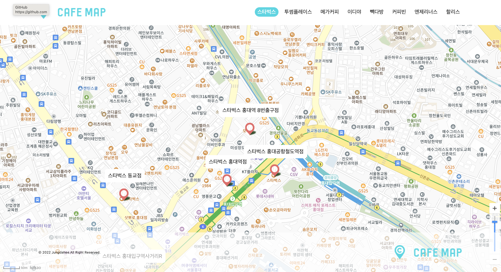

# 🗺️ cafeMap ☕︎
- 홍대에 있는 프렌차이즈 카페 위치를 알려주는 웹사이트입니다. 원하는 프렌차이즈 카페를 찾아보세요.
- [🌐 카페맵 웹사이트로 바로가기](https://enchanting-bublanina-7e9b04.netlify.app/)
 

 

### 📅 프로젝트 기간 
- 2023.03.03 ~ 2023.03.07

 

### ⭐︎ Front-end 기술선정

#### React
- 자바스크립트 라이브러리인 리액트를 중심으로 개발

#### Kakao map API
- 카카오 지도 api를 사용하여 개발

 

### 💻️ 프론트엔드 기술 스택

  

 

### 🔧 주요 기능
- 카카오 지도에서 버튼을 클릭하면 해당 마커 생성

